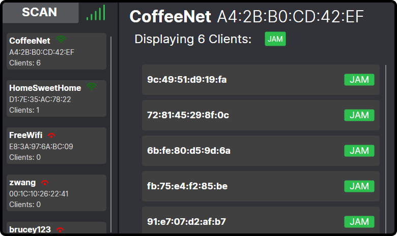

# Wi-Fi Jammer

Wi-Fi Jammer (De-authenticator) application with an Avalonia UI frontend. Designed to run on a Raspberry Pi 3B+ with the official touch screen. 
  

# IMPORTANT - DISCLAIMER
I made this as a learning project, and I have only tested this on my own networks. I do not promote to use of, or take responsibility for any malicious actions performed by this tool. Make sure you obtain permission from the network owner before you test this on any network. The term 'jammer' is used very loosely - this device simply sends de-authentication frames to devices on a network, it does not actually Jam signals. 

## Hardware
- Raspberry Pi 3B+
- Raspberry Pi 7" Touchscreen Display
- A wireless adapter capable of monitor mode, I used the `ALFA AWUS036NH`
- A case for the screen, I had one 3D printed from a design I found on Thingiverse [(link)](https://www.thingiverse.com/thing:1585924)

## TODO List
- [X] Error handling for no network interfaces detected
- [X] Improve JamAP and JamClient functions if necessary
- [X] Client needs to change channel - need to hold reference to AP in Client.
- [X] Figure out channel switching (!!!)
- [X] Think about splitting up code functionality, all my code in the view model at the moment...
- [X] Configure relative paths for CSV files
- [X] Improve README
- [X] Add README disclaimer
- [ ] Add confirmation modal to Jam buttons
- [X] Finish UI and Scan device buttons
- [X] More buttons e.g. restart app button, close app button.
- [X] Native scanning (not using air crack)
- [ ] Add OUI-based device guessing from MAC address
- [ ] Add pictures to README
- [X] Remove FileService and Artifacts
- [X] Native Scanning - Null function isn't the only client communication. Need to work on native client detection!!